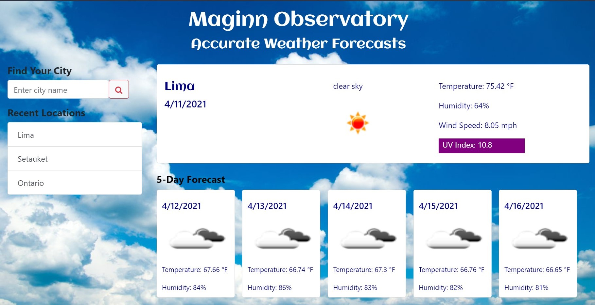

# 06 Weather Dashboard

## User Story
*AS A traveler
I WANT to see the weather outlook for multiple cities
SO THAT I can plan a trip accordingly*
 

### Build
* Program assembled HTML, CSS, JavaScript, and jQuery
* Open Weather API is used to obtain data
 

### Purpose
* Application provides current weather conditions, as well as a 5-day forecast
 

## Installation
* Runs in the browser
 

## Link to site
https://laurenjmkruse.github.io/Weather-Dashboard/
 

## Credits
To assemble this project, I relied upon the following:
* Coding Bootcamp classes taught by Michael Labieniec
* W3Schools: https://www.w3schools.com/
* MDN web docs: https://developer.mozilla.org/en-US/
 

## Screenshot

 
